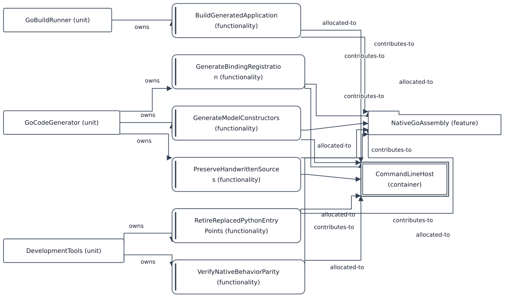

# Feature: NativeGoAssembly — modus NativeBuild

[Viewpoint](index.md) · [Navigator](../../navigator.md)

Revisjon: `be0dfcfdca6e04f7b8c4594dc5e72d920724ef96e1f604e749432121aa83e862`.

## Feature: NativeGoAssembly — modus NativeBuild

Kildegrunnlag: f0054, f0055, f0175, f0176, f0482, f0483, f0490, f0491, f0505, f0513, f0514, f0515, f0697, f0698, f0822, f0823, f1279, f1280.

