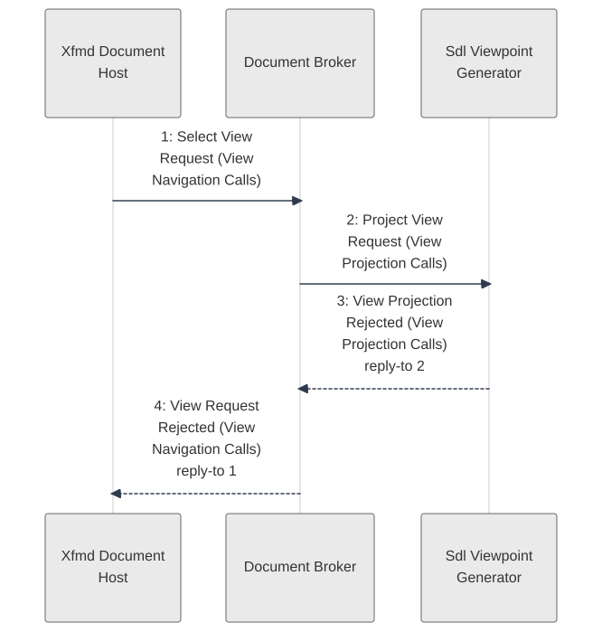

# Scenario: ViewProjectionFailed — mode DocumentBrowsing

[Viewpoint](index.md) · [Navigator](../../navigator.md)

Revision: `e946313a6ae4a80603a8f13d3467373c8fa1990eb9c42ed8f82b759ee12845e1`.

## Scenario: ViewProjectionFailed — mode DocumentBrowsing

Source facts: f0199, f0201, f0203, f0204, f0723, f0724, f0941, f0943, f1052, f1053, f1327, f1329, f1331, f1350, f1352, f1354, f1355, f1356, f1357, f1358, f1359, f1360, f1361, f1362, f1363, f1364, f1365, f1366, f1383, f1384, f1385, f1422, f1423.

