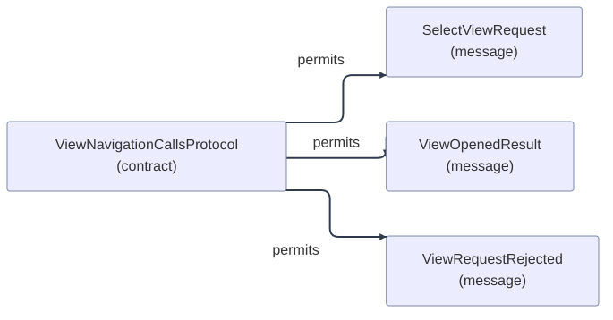

# Kontraktstruktur: ViewNavigationCallsProtocol

[Viewpoint](index.md) · [Navigator](../../navigator.md)

Revisjon: `be0dfcfdca6e04f7b8c4594dc5e72d920724ef96e1f604e749432121aa83e862`.

## Kontraktstruktur: ViewNavigationCallsProtocol

Kildegrunnlag: f1329, f1330, f1331.

