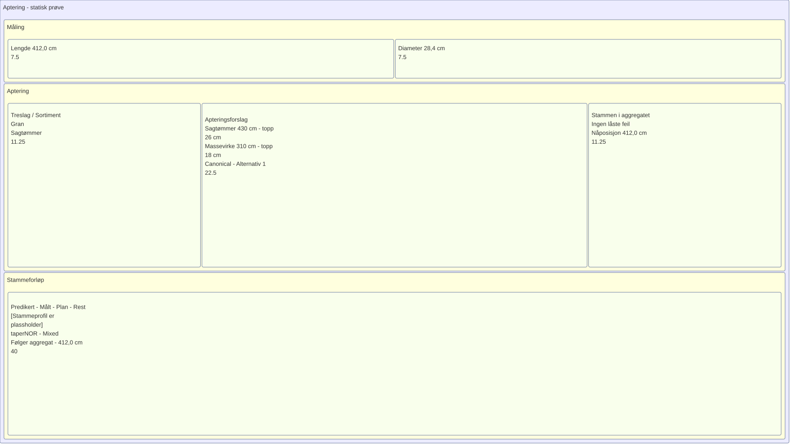

# Aptering — statisk treemap-prøve

Denne prøven viser boksene og teksten samlet. Den er rendret med den lokale
Mermaid Rust-rendereren og lagt inn som SVG-bilde, slik at Markdown-leseren
kan vise samme layout uten å beregne diagrammet på nytt.

Radene fordeles 15/45/40; midtkolonnene 25/50/25. Overskrifter, padding og gap
tar plass innenfor gruppene. Tallene 7.5, 11.25, 22.5 og 40 er arealvekter som
rendereren også skriver i boksene; de er ikke apteringsdata.

Innholdet er bevisst forkortet. Dette er en håndlaget mulighetsprøve basert på
Concept1-layouten, ikke en generell SDUI-eksport. Etikettene er enkel tekst med
linjeskift; tabeller, full Markdown og native widgets er ikke implementert.

[Treemap-kilde](../evidence/treemap-probe/view.mmd) ·
[Renderer-konfigurasjon](../evidence/treemap-probe/config.json)
