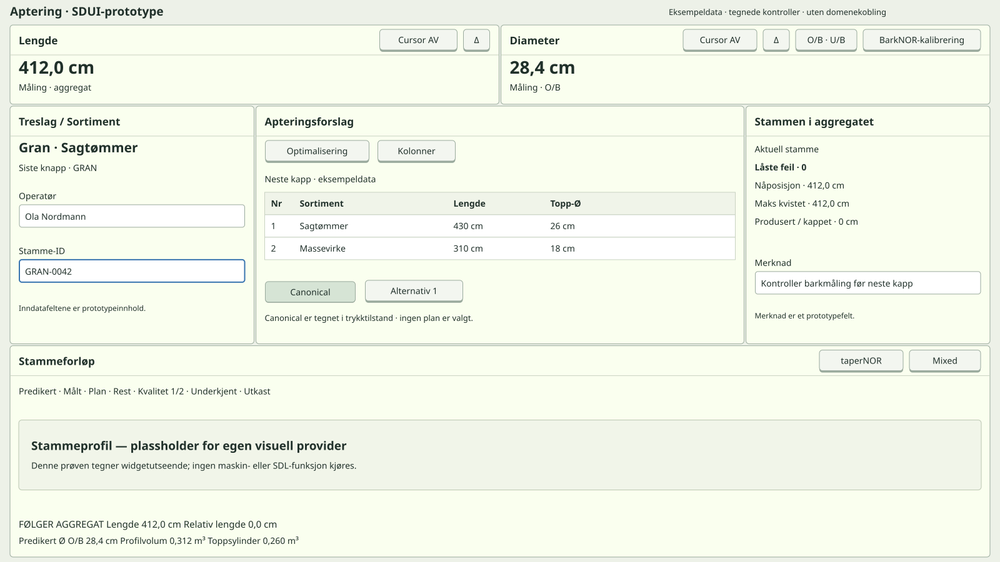
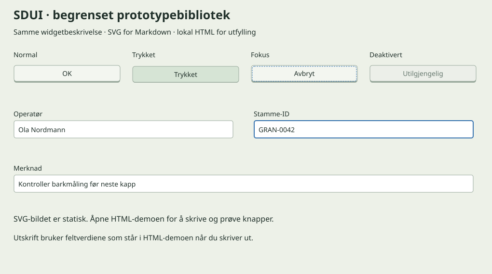

# Bucking — SDUI prototype widgets

Buttons and inputs share the treemap probe's box structure. This is a static image;
labels/values come through the SDUI parser. Placement is a bounded reference composition,
not general layout. Heading rows contain Cursor AV/Δ for Length/Diameter, O/B · U/B and
BarkNOR calibration for Diameter, and taperNOR/Mixed for Stem track. Norwegian labels in
the image are intentional localized prototype content.

Operator, Stem ID and Note are added prototype content, not claims about existing Ponsse
fields. Other values are also examples.

## Limited widget library

## Try editing and button presses

Open the [local HTML demo](prototype-controls.html) in a browser. Edit fields, activate
buttons with mouse/keyboard, and choose its localized print-filled-values control.
Print uses current values and wraps long text; the browser dialog can save PDF.
Reload restores examples. The demo shows the widget set, not an interactive version of
the whole bucking surface. Buttons provide local visual response and a press counter.

[Widget source](prototype-controls.sdui) · [Bucking source](concept1-bucking.sdui) ·
[Scope and continuation](../docs/prototype-widgets.md)
