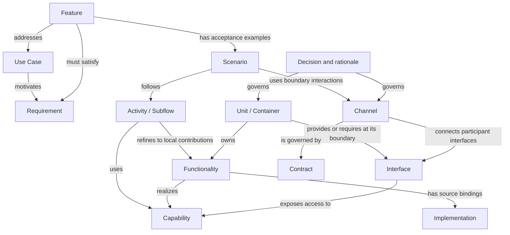

# Study: Features, Functionality, Containers and Channels

Current discussion entry: [Checkpoint #1](checkpoint%231/README.md), 2026-09-18.
Its Functionality-before-allocation proposal reconsiders this study's unit-local
definition; no grammar change has been adopted. Preserve this document as the
reasoning baseline, not an alternative meaning silently selected by the reader.

Date: 2026-09-15  
Status: research and recommendations for discussion; no adopted schema or language  
Scope: clarify the owner's model and assess existing modeling approaches  
Working baseline: PR #4 branch, `d611b8bf72aeb30d86c5ef28902469462b06a803`

## 1. Finding and recommendation

The owner's model is coherent if it keeps three concerns distinct:

- **Intent:** what an actor needs and what the product promises to make possible.
- **Responsibility:** which unit owns each contribution to that promise.
- **Interaction:** how those units collaborate under explicit contracts.

Recommended working vocabulary: Use Case, Requirement, Feature, Unit/Container,
Functionality, Capability, Interface, Channel, Contract and Scenario. Following
the owner's further clarification, Capability has a distinct purpose: describe
an ability realized by coordinated Functionalities, at a named internal or
external boundary. It need not be a duplicate label on every Functionality.

The owner also asks for progressive navigation from scenario flow and state
changes to units, contracts and actual source functions, with change-impact
analysis in both directions. The companion
[Scenarios, state and implementation traceability](Scenarios-State-and-Implementation-Traceability.md)
develops that proposal, distinguishes events from activities, and defines a
small evaluation case. These relationships are now part of the tool-selection
question, beyond drawing a structural diagram.

The most useful existing foundations are C4 for runtime structure,
ports-and-adapters for boundary design, Enterprise Integration Patterns for
messaging concepts, and AsyncAPI/OpenAPI for actual communication descriptions.
Structurizr can connect structural views with scenario views. Context Mapper
offers a closer domain/use-case model; SysML v2 is the strongest candidate in
this comparison for a single richer requirements/structure/behavior language.
These are complementary options, not a recommendation to install all of them.

**Recommendation:** first compare a small C4/Structurizr model with referenced
API contracts against a small SysML v2 model of the same case. Use existing SDP
requirements and decision records for authority. Do not start by implementing
a general-purpose SDP language, compiler or communication framework.

This is an architectural assessment, not a tool benchmark. No parser, generator,
product code, deployment or live machine interaction was exercised.

## 2. Owner intent and provenance

The owner clarified the following in the conversation on 2026-09-15:

1. A complete system contains bounded units that may have separate processes
   and source code. Each unit has its own internal horizontal design layers.
2. A Feature supports something a Use Case needs and may cross several units.
3. Functionality is bounded within a unit and contributes to Features.
4. Features and Functionalities have a many-to-many relationship.
5. Channels connect units using a communication standard and contract. They
   should be reusable rather than created mechanically for each Feature.
6. The relationship between Capability, Functionality and Channel needs study.
7. Existing languages and established methods should be investigated before
   inventing new machinery.

These are inputs to this study. Definitions and constraints added below are
recommendations, not claims that the owner has already approved their details.

Subsequent clarification in the same conversation: internal Functionalities
can combine to realize a unit/container Capability; the boundary should show
what it provides, consumes and requires. Scenarios should connect user-oriented
flow, conditions and state changes to progressively more detailed implementation
views. Sections 3.2–3.5 and the companion study incorporate this input. Exact
relation types and execution semantics remain proposals for evaluation.

The owner subsequently agreed with these conceptual refinements and asked to
explore nouns, verbs, adjectives and temporal grammar. See
[Vocabulary and grammar exploration](Vocabulary-and-Grammar-Exploration.md).
This records conceptual agreement without implying adoption of a parser or
canonical schema.

### 2.1 Relationship to previous SDP work

The committed PR #11 research baseline inspected was
`319ee2a43fe8a05bc3aac0860ff937bba57819ee`. Its
[research synthesis](https://github.com/Hans-Einar/SDP/blob/319ee2a43fe8a05bc3aac0860ff937bba57819ee/SystemDesignLanguage/research/README.md)
and [32-language catalog](https://github.com/Hans-Einar/SDP/blob/319ee2a43fe8a05bc3aac0860ff937bba57819ee/SystemDesignLanguage/research/existingDesignLanguages/README.md)
already distinguish capability, design objects, change objects and classification.
They leave pathway semantics and language selection open.

A newer local owner-intent document also exists:
[~/git/SDP-research-issue-10-system-design-/SystemDesignLanguage/Mandate-and-Study.md](/home/warloc/git/SDP-research-issue-10-system-design-/SystemDesignLanguage/Mandate-and-Study.md).
The inspected file was **untracked**, revision 0.1 dated 2026-09-14, SHA-256
`33c8828fb55706d34b97279a3a3b524b6422a739d1ab63fdb6fb1293863912cf`.
It must not be attributed to the PR's committed head. Sections 3.3 and 10
introduce Feature/Functionality/Channel with provisional semantics; section 14
uses a hypothetical measurement-unit change to expose missed consumers.
This study read those relevant sections and provenance, not every section of
that longer document or its DOCX counterpart.

The latest owner clarification sharpens the earlier draft: Functionality now
has a **unit-local responsibility boundary**. Its end-to-end composition belongs
in a Feature realization/scenario, rather than in one unbounded Functionality.

Relevant existing-language profiles were read for ArchiMate, CML, Structurizr,
LikeC4, AsyncAPI, OpenAPI, SysML v2, AADL, UML, Smithy and Protobuf. Selected
primary documentation was checked again for this study. This is a focused
extension of the earlier research, not a rerun of all 32 evaluations.

The [Feature governance proposal](Feature-Governance-And-SDP-2.0.md) remains
context for durable intent and integration studies. Nothing here installs its
proposed schemas, changes PR #4's installer contract, or completes PR #8.

## 3. Vocabulary that preserves the distinctions

The following is a **proposed SDP interpretation**, not a claim that all cited
standards use these words identically.

| Term | Question answered | Proposed meaning and boundary |
|---|---|---|
| Use Case | What must an actor accomplish? | Actor goal and meaningful interaction with a subject system; independent of the current implementation decomposition. |
| Requirement | What must hold for the solution to be acceptable? | A sourced, testable behavior or constraint. Includes quality and shared design obligations where applicable. |
| Feature | What durable product behavior supports that goal? | A coherent product offering with outcome, scope and acceptance scenarios; may span one or several units. |
| Unit | Where is responsibility bounded? | A named design responsibility boundary; its runtime and source bindings are stated separately. |
| Container | What application or data-store boundary exists at runtime? | Use C4's meaning when the unit actually has that character. |
| Functionality | What behavior contributes to an ability? | A cohesive behavioral responsibility within one Container, owned by one identified internal unit where decomposed; may use several internal layers and depend on external contracts. |
| Capability | What can this unit reliably accomplish under stated conditions? | A scoped ability realized by coordinated Functionalities and required resources/contracts; internal or externally offered relative to a named boundary. |
| Interface / port | What can a collaborator use or provide here? | The exposed boundary through which a unit offers or requires behavior. It need not be a separate runtime service. |
| Channel | Through what logical communication arrangement do units interact? | A reusable connection among identified participant roles, governed by a contract and bound to concrete communication mechanisms. |
| Contract | What makes an interaction valid? | Operations/messages, meaning, obligations, errors and compatibility, with referenced machine-readable schemas where suitable. |
| Scenario / Feature realization | How does a particular outcome happen? | A user-oriented path/example through a behavior flow, with entry conditions, actions and outcomes. The flow defines alternatives; a trace records an actual execution. |
| Activity / Subflow | What reusable behavior gets us from these conditions to these outcomes? | A bounded behavior containing steps, branching and possibly concurrent work, refinable into local contributions; not assumed atomic. |
| State / Transition / Event | What holds, what changes, and what happened? | State describes relevant values/modes; a transition relates before/after state under a trigger/guard; an event is an occurrence, not an entire multi-step workflow. |

### 3.1 Feature and Use Case are related, not identical

A Use Case could be “inspect the current measurement and decide whether to
continue.” Features could include live display and access to measurement
history. Either Feature might also support another Use Case. Conversely,
one Use Case may need several Features. Avoid a compulsory one-to-one mapping.

Keep Feature identity stable when responsibility moves between units, provided
its intended product meaning is preserved. Changes in behavior still require
an explicit revision. A Feature is not a PR, a code folder or an API method.

Not every technical change needs a fabricated user Feature. A shared dependency
restriction, performance constraint or behavior-preserving refactor can have
its own requirement/decision/work authority and links to affected Features.
The owner need should remain easy to find without forcing all architecture
decisions into a “user-facing” category.

### 3.2 Functionality is an architectural responsibility, not every function

Examples are “maintain the current validated measurement,” “present current
measurement with freshness state,” and “record measurement history.” Each has
meaningful state, behavior or invariants and an accountable owner.

A Functionality can involve multiple classes, functions or layers. It may
depend on another unit, but the remote unit's responsibility is modeled
separately. For example, a UI's presentation Functionality requires the
measurement provider's interface; it does not acquire ownership of the
provider's validation logic.

**Proposed modeling rule:** Functionality stays within a Container and has one
accountable unit per model revision. An internal unit may own it; the Container
contains that ownership without duplicating the object. Where an apparent
Functionality crosses Containers, distinguish
the local contributions and their collaboration. Reusable library definitions
can have multiple bindings; record which unit owns state and obligations in
each use rather than pretending shared code is another running service.

“Functionality” is suitable for the owner's vocabulary. For individual model
elements, **Function** or **Functional responsibility** may read more naturally
in English. The naming choice is still open; it should not change the boundary.

### 3.3 Offered Functionality needs an interface view

There are two useful descriptions of the same responsibility: its internal
realization and what another unit can rely on. An internal algorithm is not
automatically a public promise. Conversely, a public operation should not
expose all internal details.

ArchiMate's documented distinction between internal Function/Process and
externally offered Service is a useful conceptual precedent. This is a mapping
aid, not a one-to-one equivalence with the proposed SDP types.
[ArchiMate community introduction](https://archimate-community.pages.opengroup.org/workgroups/archimate-101/)

The ports-and-adapters pattern supplies a complementary implementation idea:
keep application behavior behind purposeful boundaries and adapt external
technologies at those boundaries. A transport replacement should not require
moving domain rules into a UI adapter.
[Cockburn's original description](https://alistair.cockburn.us/hexagonal-architecture)

### 3.4 Capability is the ability; Functionality realizes it

The owner's clarification gives Capability a useful independent role. A unit
may validate input, correlate samples, maintain state and publish observations.
Their coordinated realization can provide the capability “supply coherent
measurements.” The ability is not the sequence itself: sequencing, parallelism,
recovery and state changes describe **how** it is realized.

Capabilities may be identified bottom-up from existing design or specified
top-down from a needed outcome. A list of available functions alone does not
establish an ability: their contracts must compose, and necessary resources,
state, permissions and quality conditions must hold. Existing abilities may
support several Features without owning those Features' complete user journeys.

Use one Capability concept with an explicit owner, scope and exposure:

- **Internal capability:** relied on inside a named boundary, such as a
  module's ability to correlate samples within a Container.
- **Provided capability:** offered to collaborators across that boundary under
  a contract, such as the Container's coherent measurement observation service.
- **Required capability:** an ability expected from a collaborator, expressed
  as a requirement on that boundary rather than a copy of the provider's model.

Exposure is relative: a module's provided interface may be internal to its
Container. Multiple local capabilities can support a Container capability; an
internal helper is not automatically an externally supported contract.
Protocol support declarations and UI Representation capabilities such as `edit`
retain their specific meanings; neither should imply product control authority.

A Channel supplies communication access to an offered ability; it is not the ability.
“Can supply a current reading” differs from “uses a WebSocket connection.”
Transport connection success also does not establish semantic compatibility.
Capability negotiation should be designed only if participants genuinely vary
at runtime; otherwise a declared, tested contract is simpler.

### 3.5 Provides, consumes, requires and depends on

Use these relations to answer different questions, rather than as synonyms:

| Relation | Proposed use | Example |
|---|---|---|
| Provides | A supported offer at a boundary, linked to its Capability and contract. | Measurement unit provides coherent observations. |
| Consumes | Actual use of an interface, data stream or service; says nothing by itself about necessity. | UI consumes observations; diagnostics also consumes them. |
| Requires | A necessary condition for a named ability/mode, including quality and availability expectations. | Live display requires fresh observations; viewing cached history may not. |
| Depends on | A typed dependency relationship, with scope and failure consequence. | Display freshness depends on source identity/time semantics, not merely on a socket being open. |
| Uses / utilizes | Readable prose when precision is unnecessary. | Avoid a separate canonical relation for `utilizes`; it does not add a clear distinction. |

“Requires” need not mean the whole application cannot start. Record the affected
capability/mode, optional or conditional use, and degraded behaviour. Distinguish
runtime service, build/library, data and deployment dependencies. Also keep
invocation direction separate from data-flow direction: a client requests an
operation from a provider while returned data flows the other way.

An initial unit description can contain purpose, owned state, provided/internal
Capabilities, consumed/required contracts, internal Functionalities, dependency
rules and source bindings. This is a proposed view over existing records, not
an instruction to create another registry.

## 4. Units, containers, layers and deployment

C4 defines Container as an application or data-store runtime boundary. A code
module or library alone normally is not a Container. A Container also need not
equal one OS process: the official explanation includes isolated applications
sharing a runtime, with deployment modeled separately. C4 explicitly allows
teams to adapt its terminology.
[C4 Container](https://c4model.com/abstractions/container)

**Recommendation:** use “Unit” in owner-facing discussion and “C4 Container”
when referring to the actual runtime view. If a logical module merely *could*
be extracted into its own process, record it as a logical boundary until that
deployment exists or is explicitly proposed. Do not distribute the application
just to make the diagram match the vocabulary.

Keep these independent:

| Dimension | Example | Avoid assuming |
|---|---|---|
| Domain/model boundary | Measurement terminology and rules | One domain means one process |
| Runtime boundary | Browser UI, measurement application, history worker | One Container means one Git repository |
| Internal layering | Presentation, application behavior, domain rules, adapters | All units must have identical layers |
| Source binding | Repository, package, symbols, generated files | Every source folder is an architecture unit |
| Deployment instance | Two replicas of the history worker | Each replica is another design responsibility |

The horizontal layers are local to each unit. A Feature crosses units through
their boundaries and can use several layers inside each one. Layer dependency
rules and runtime message direction are different: a runtime response can
travel outward without reversing the permitted source dependency direction.

## 5. Reusable Channels without accidental coupling

### 5.1 Three levels to describe separately

1. **Logical interaction:** a provider and consumers collaborate for a named
   purpose, such as measurement observation.
2. **Contract/interface:** allowed observations, requests, responses and state
   changes, including their meaning and obligations.
3. **Binding:** concrete protocol, address/routing, serialization and deployment
   configuration that realize the interaction.

These can initially be sections of one record. They need not become three new
registries. One logical Channel may require multiple concrete channels or
operations, such as snapshot request/response plus live updates.

The term has an established messaging meaning. Enterprise Integration Patterns
distinguishes, among others, point-to-point and publish-subscribe channels.
Competing consumers and independent subscribers require different semantics;
adding another receiver is therefore a contract question.
[EIP overview](https://www.enterpriseintegrationpatterns.com/patterns/messaging/)

AsyncAPI supplies message-driven API descriptions with channels, operations,
messages and protocol bindings. Its channel is an addressable messaging concept;
an SDP logical Channel may be broader and should map explicitly to the concrete
AsyncAPI objects. Application perspectives matter: a sender's description is
not sufficient evidence of a receiver's complete contract.
[AsyncAPI 3.0 definitions](https://www.asyncapi.com/docs/reference/specification/v3.0.0#definitions)

For an HTTP interface, use OpenAPI operations instead of forcing it into a
message-broker model. An in-process boundary may only need a typed interface
and behavioral tests. “Logical connector” is an alternative label if the broad
SDP meaning of Channel repeatedly causes confusion.
[OpenAPI 3.2.0](https://spec.openapis.org/oas/v3.2.0.html)

### 5.2 Choose channel boundaries by shared semantics

**Proposed design criteria:** reuse a Channel when purpose, data meaning,
authority, lifecycle, delivery expectations and compatibility policies fit.
Split when their differences create harmful coupling. Reuse is not a target
channel count.

A Channel named after every Feature duplicates plumbing and contracts. One
universal Channel carrying arbitrary payloads can hide domain dependencies,
erase useful types and make every change everyone's problem. A new Channel
is justified when isolation, participants or semantics require it, even if
only one Feature initially needs it.

Several logical Channels can share one physical connection. Conversely, one
logical interaction can use several physical routes. Neither case should
duplicate the identity of the Feature using them.

### 5.3 Contract content selected by consequence

The following is a checklist for the proposed model, not a requirement that
every small interface implement every mechanism.

| Contract concern | Questions the responsible designer must resolve |
|---|---|
| Meaning | What does each value/event mean? Units, identifiers, validity and source authority? |
| Behavior | What operations are permitted? Preconditions, state effects and completion signals? |
| Participants | Who provides, sends, receives and owns each effect? Fan-out or competing consumers? |
| Time/currentness | Timestamp meaning, ordering scope, stale data, reconnect and snapshot/update races? |
| Failure | Timeout, rejection, duplicate handling, retry limits and partial completion? |
| Load | Buffering, backpressure, permitted loss and overflow behavior? |
| Access | Which roles may read or change state? Which data may cross this boundary? |
| Evolution | Supported versions, semantic compatibility, mixed-version operation and migration? |
| Evidence | What observations and tests demonstrate the promised behavior? |

Reference an existing communication standard for what it actually defines.
Do not infer domain correctness, exactly-once effects or end-to-end ordering
from the mere presence of a broker, protocol name or valid data schema.
Unknown guarantees should remain explicitly unknown.

## 6. Relationships: a graph, not a containment tree

The following is a conceptual model, not executable DSL syntax or an installed
SDP schema. Arrow labels describe meaning; they do not all mean “depends on.”

Useful proposed rules for a later pilot:

- Features and Functionalities are many-to-many through their realizations.
- One Functionality has one accountable unit in the chosen model revision.
- A Channel has explicit participant roles, with multiplicity appropriate to
  the interaction. A shared contract definition can be reused across bindings.
- Every scenario step references existing responsibilities/interfaces rather
  than creating a fresh copy of the architecture.
- Every cross-unit scenario interaction resolves to an allowed contract and
  binding; local execution steps need not invent Channels.
- Known Feature requirements and shared invariants must be reachable from the
  scenario view. A graph alone cannot infer a dependency that was never modeled.

A Feature-level view can summarize the relevant subgraph. A scenario explains
a particular collaboration. An observed trace identifies an actual run. Keep
these distinct so that a static connection is not mistaken for evidence that
the required sequence happened.

Cross-unit workflows also need an explicit account of coordination: who owns
workflow state, detects partial failure and decides what happens next? The
answer can be an orchestrating unit or a defined collaboration among units.
A Feature does not require a dedicated process, and a Channel or broker does
not automatically own business coordination. Keep this responsibility visible
when decomposing an end-to-end workflow into local Functionalities.

For behavior semantics, refinement links and source-level impact analysis,
continue with the companion
[Scenarios, state and implementation traceability](Scenarios-State-and-Implementation-Traceability.md).
It distinguishes a flow edge from a source call, and a planned binding from
observed implementation. This graph is a conceptual navigation model, not an
executable state machine or a complete call graph.

## 7. Worked example: shared measurement observation

**Hypothetical, software-only fixture.** This borrows the measurement theme
from the local vNext draft. It is not a verified description of Concept1 and
does not propose a machinery-control implementation.

### 7.1 Intent and local responsibilities

| Object | Example |
|---|---|
| Use Case A | Operator assesses the current measurement |
| Use Case B | Analyst reviews previous measurements |
| Feature A | Live measurement display with visible freshness |
| Feature B | Browse recorded measurement history |
| Measurement unit Functionality | Validate and maintain readings; provide observations |
| UI unit Functionality | Maintain display state; present readings and freshness; navigate history |
| History unit Functionality | Record observations; answer historical queries |
| Shared Channel | Measurement observation, used by the UI and history unit |
| Separate interface | History query, used by the UI to retrieve past readings |

The measurement provider supports both Features without knowing their UI
layouts. The UI's presentation responsibility can be reused across live and
historical views where the behavioral contract fits. Recording and displaying
remain different local responsibilities.

The Capability “Provide validated measurements” describes the measurement
unit's offer; local Functionalities realize it and its interface exposes it.
This supplies the explicit boundary view requested by the owner without adding
a new transport or duplicating the Functionalities.

### 7.2 Logical Channel and binding

Illustrative logical contract `measurement-observation`:

- Participants: measurement provider, current-display subscriber, recording
  subscriber. Each subscriber receives the observations it requires; they must
  not accidentally compete for a single queue's deliveries.
- Observation meaning: measurement ID, revision/sequence scope, value, declared
  unit, time semantics and validity. Exact representation remains a design choice.
- Current-display obligation: do not show an older revision as current; indicate
  loss of freshness according to the accepted requirement.
- Recording obligation: preserve identity and avoid duplicate records under
  the selected delivery policy.

One candidate binding combines a snapshot HTTP operation with streamed updates.
That logical Channel consequently references more than one concrete operation.
The join between snapshot and stream must avoid a missed or reversed update.
This obligation is not solved merely by choosing HTTP plus WebSocket.

The definition can be shared by both Features. A second UI Feature, such as an
agreed trend view, can reuse it without adding a Feature-specific Channel if
its sampling and delivery requirements are compatible.

### 7.3 Change impact that the model must reveal

Suppose the proposed wire meaning changes from millimeters to meters while
the numeric type stays unchanged. This is a semantic contract change, even if
a schema validator still accepts the messages.

Required impact analysis for this hypothetical change includes:

1. Provider serialization and versioned contract.
2. UI conversion, precision and freshness behavior.
3. History consumer conversion and interpretation of existing records.
4. Both affected Features and their acceptance scenarios.
5. Mixed-version participants, configured bindings and migration strategy.

An illustrative witness uses an input representing one meter, checks the agreed
display representation and validates stored physical meaning. Separate cases
exercise reconnect, old messages, duplicates and incompatible participants
where those are part of the agreed contract.

The graph nominates affected areas; it does not prove they are complete.
An independent source/configuration inventory should also look for consumers
absent from the model. If found, record incomplete coverage rather than making
the graph's apparent completeness an acceptance claim.

## 8. Existing language and method fit

The assessments in the final two columns are this study's inferences from
documented capabilities. They are not measured tooling results.

| Candidate | Existing mechanism | Fit for this model | Important boundary |
|---|---|---|---|
| C4 + Structurizr DSL | Runtime structure and multiple views; dynamic views reuse relationships for ordered interactions | Strong practical baseline for units and Feature scenarios | Feature identity, document authority and behavioral compatibility need explicit SDP conventions |
| LikeC4 | Custom element/relation kinds and views | Flexible alternative if fixed C4 categories obstruct the pilot | Naming an element `feature` does not give it Feature semantics or enforcement |
| Context Mapper CML | Use cases/stories, bounded contexts, services and cross-context coordination | Close fit for intent-to-domain-responsibility exploration | Bounded context is not a process; full Channel/deployment semantics need additional mapping |
| SysML v2 | Requirements, parts, actions, ports/interfaces, connections, use cases and verification cases | Strongest unified language candidate examined here | Learning and tooling cost must be measured; language `feature` is not SDP Feature |
| ArchiMate | Ability, structure and internal/external behavior perspectives | Useful vocabulary and owner-facing architectural views | Does not supply a full executable wire contract; avoid assuming old element names apply unchanged |
| AsyncAPI / OpenAPI | Message-driven / HTTP API descriptions | Reuse for concrete Channel bindings and interface contracts | Neither replaces product intent, local ownership or end-to-end evidence |
| EIP + ports-and-adapters | Integration pattern vocabulary and boundary design | Reuse concepts without writing a new protocol framework | Patterns are design guidance, not a machine-readable full system model |
| arc42 + decision records | Structural decomposition, runtime scenarios, source mapping and rationale | Closely matches progressive navigation between behavior, building blocks and code | Documentation structure needs maintained links; it does not execute flows or establish complete impact automatically |

Primary references for these mappings:

- Structurizr demonstrates ordered instances of shared relationships in
  [dynamic views](https://docs.structurizr.com/dsl/cookbook/dynamic-view/).
  This directly supports multiple Feature scenarios over shared structure.
- LikeC4 describes its model/specification/view approach in the
  [DSL introduction](https://likec4.dev/dsl/intro/).
- CML documents [user requirements](https://contextmapper.org/docs/user-requirements/)
  and [application services and coordination](https://contextmapper.org/docs/application-and-process-layer/).
  Its coordination has restrictions on service references; it does not explicitly
  encode orchestration-versus-choreography as a syntax choice. That limit matters
  when assessing whether a pathway description expresses all required behavior.
- SysML v2's [normative language specification](https://www.omg.org/spec/SysML/2.0/Language/PDF)
  covers ports (7.12), connections (7.14), interfaces (7.15), requirements
  (7.21), verification cases (7.24) and use cases (7.25). These offer established
  modeling machinery; implementing a domain-specific SDP interpretation would
  still require a small, explicit profile/library and supporting process.
- arc42 separates [crosscutting concepts](https://docs.arc42.org/section-8/)
  from [architecture decisions and rationale](https://docs.arc42.org/section-9/).
  These can map into existing SDP documents rather than creating a parallel
  documentation hierarchy.

### 8.1 Version and terminology findings worth carrying forward

The previous catalog's AsyncAPI profile examines 3.0. This study also checked
the official [3.1.0 specification](https://www.asyncapi.com/docs/reference/specification/v3.1.0),
which retains separate channel, message, operation and binding concepts.
Select a concrete supported parser/generator version during a pilot; a newer
specification page is not proof that every tool supports it.

The Open Group's [ArchiMate 4 announcement](https://www.opengroup.org.cn/node/12886)
reports changes including consolidated behavior elements and removal of the
former Contract element. Therefore, an older “Application Function / Application
Service / Contract” mapping must not be advertised as an exact current-version
metamodel without checking that version. This study used the community
introduction for conceptual guidance and the announcement for version context;
it did not establish full ArchiMate 4 conformance or perform a licensing review.

UML and AADL remain relevant alternatives in the earlier catalog. AADL deserves
renewed attention if deployment timing, resources and hardware/software
allocation become central; that is a different emphasis from the current
owner-intent and shared-communication question. Smithy or Protobuf may be useful
contract representations where the actual implementation calls for them.
They are not additional required dependencies of the proposed pilot.

The word **feature** in a language specification may mean a modeling property,
port or product-configuration option. It must be mapped deliberately to SDP's
durable product Feature rather than matched by spelling.

## 9. What SDP should supply, and what it should reuse

**Proposed minimum SDP addition:** a small semantic profile connecting existing
objects and artifacts. Avoid duplicating detailed API schemas or every class
inside a second model.

| Information | Preferred authority | What the SDP connection adds |
|---|---|---|
| Actor need and acceptance | Existing Use Case/Requirements/Feature documents | Links to realization and current evidence |
| Unit responsibility and local layering | Architecture/Design and selected structural model | Explicit ownership and inherited constraints |
| Wire/API structure | Actual versioned interface description | Provider/consumer and Feature impact references |
| Behavioral meaning | Requirements/Design plus contract semantics | Units, state/currentness, failure obligations and their reasons |
| Design choices | Existing decision records | Status, rationale, rejected alternatives, applicability and supersession |
| Source/deployment facts | Code/configuration inventory tied to a candidate | Evidence of actual bindings and unmodeled dependencies |
| Completion | Verification/review and real owner dispositions | Separation of implemented, integrated, verified and accepted |

For a short owner prompt, the agent should recover the affected Feature,
local contributions, Channels and enclosing decisions. It then proposes a
bounded change and identifies affected consumers before implementation.
The owner should not have to list all those relationships manually.

When implementation reveals a missing obligation, distinguish a necessary
consequence of an accepted requirement from a new product choice. Update the
current requirement/design/contract at its authoritative location, preserve
the derivation or decision source, and link the work/evidence to it. A ledger
entry about the discovery is not a substitute for the updated behavioral rule.

This can be practiced with existing vNow documents and ordinary links. A future
language or validator can make discovery and consistency cheaper. It cannot
decide the owner's preferences or prove unobserved program behavior.

## 10. Proposed bounded evaluation

No evaluation described in this section has been executed. Its purpose is to
make the next tool choice testable without starting a language project.

Use the hypothetical case in section 7: three application units, two Features,
shared measurement Functionality, one observation Channel with multiple
consumers, and a separate history-query interface. Declare local layers only
where they affect the experiment.

Compare two representations of identical facts:

| Track | Representation | Question |
|---|---|---|
| A | Structurizr DSL + referenced API contracts + existing SDP decision/requirement links | Can a small linked model provide enough precision without inventing a language? |
| B | A small SysML v2 package with the same external contract references | Does richer native semantics remove enough custom work to justify its cost? |

Choose and pin actual tools before execution. Do not simultaneously introduce
CML, LikeC4 and a custom compiler. Revisit CML if domain decomposition is the
main unresolved problem, or LikeC4 if C4's fixed structure blocks a needed view.

Apply the same challenges to both tracks:

1. Add a Feature reusing the observation interface. It should not require a
   duplicate provider or a new Feature-specific Channel.
2. Change measurement units without changing the payload's numeric type.
   Identify both consumers and all affected acceptance scenarios.
3. Move a local responsibility into another unit. Show changed ownership,
   boundary interactions and preservation requirements without redefining the
   user's Feature merely because source location changed.
4. Introduce a bypass of an agreed unit/layer interface. Determine what the
   model detects and what independent code/configuration analysis must detect.
5. Omit a consumer from the declared model. Report incomplete coverage when
   independent observations reveal it; do not claim automatic completeness.
6. Provide a well-specified local fix. It should reuse current authority without
   demanding a new Feature, Channel or full-system redesign.
7. Change one scenario branch. Navigate its activities, guards, provided/required
   Capabilities and contracts to concrete source symbols and affected witnesses.
   Identify unimplemented bindings, asynchronous dependencies and unmodeled
   consumers instead of presenting a complete-looking but unsupported call chain.

For each challenge, distinguish native language validation, profile convention,
custom validation, external runtime evidence and human/agent judgment. Record
authoring effort, duplicated facts, source maintenance, useful context size,
owner readability and unsupported claims. Test a simple in-process variant as
well, so the method does not accidentally require distributed architecture.

Completion means a reproducible comparison and a justified recommendation.
It does not mean approval to migrate Concept1, publish Toolkit changes or build
a full language/runtime.

## 11. Decisions still open

| Decision | Study recommendation | What would change the recommendation? |
|---|---|---|
| Unit versus Container label | Unit for discussion, explicit C4 mapping for runtime views | Repeated confusion or a project consisting only of runtime units |
| Functionality name | Preserve meaning; evaluate “Functional responsibility” for individual elements | Owner readability and modeling effort in the small case |
| One local owner | One accountable unit per Functionality per revision | A demonstrated responsibility that cannot be decomposed without losing necessary meaning |
| Capability representation | Explicit scoped ability and realization/exposure links; owner clarification establishes the need for this view | Pilot determines whether lightweight sections suffice or stable standalone identities are needed |
| Channel breadth | Logical connector with explicit contract and binding mapping | Broad usage obscures the narrower messaging meaning in practice |
| Modeling language | Compare existing lightweight composition with SysML v2 | Measured information loss, maintenance cost and validation coverage |
| Canonical SDP integration | First apply vocabulary through current documents; adopt schemas separately | An accepted pilot and compatibility plan justify tooling changes |

The strongest conclusion is that most necessary concepts already exist.
SDP's distinctive work is to connect them to durable product intent, current
decision authority, bounded agent assignments and evidence about the actual
integrated system.

## 12. Study validation and limits

Local document links and Markdown fence pairing were checked; the README index
links to this study. Whitespace checking preserves intentional Markdown hard
line breaks.
The source comparison is documentary: neither the diagram nor the proposed
model rules were executed in a modeling tool. The hypothetical scenario was
not tested against a product. No independent study review has been performed.

The research worktree, its untracked mandate and the existing skill candidates
were left unchanged. The subsequent capability/scenario clarification updates
this study and adds the linked behavior/source-traceability companion; it does
not register a canonical Feature/Functionality/Channel schema.
