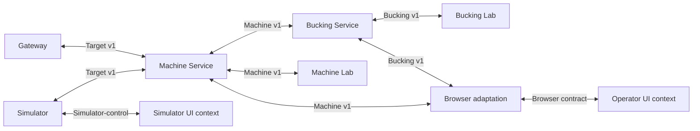
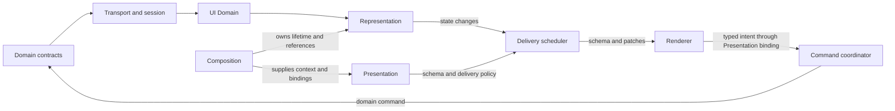
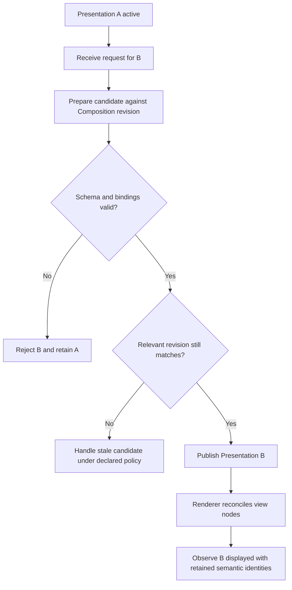

# MVP1 design described through the proposed vocabulary

Date: 2026-09-15

Language reference: [Design language definition](Design-Language-Definition.md).
This worked example predates that core definition. Its sentence blocks remain
exploratory fragments and do not claim full `design-core 0.1` conformance.

Status: worked design-language example. The September 10 UI direction is selected
by the owner. This document expresses that direction and inherited system
obligations; new names, allocations and contracts below are proposals where
marked. It is not a declaration that the target is implemented.

## 1. Reading the example

The description has three levels: the complete MVP1 system; the UI responsibility
boundary; and a UI scenario refined into internal behavior and source bindings.
English sentences and diagrams describe the same intended facts. No parser has
validated them and the diagrams have not been executed.

Source baseline: Ponsse revision
`7589a5811a21ec6bb13979612060ceff0f690df8`, its
[constituent registry][registry], [system discussion][system-discussion] and
[UI discussion][ui-discussion], followed by the owner's selection recorded in
[the MVP1 study](MVP1-Design-Evolution-and-SDP-Skills.md#11-owner-decision-september-10-design-is-the-target-direction).
This example does not refresh GitHub lifecycle status or authorize held work.

Statement status is explicit:

| Label | Meaning |
|---|---|
| Inherited | A responsibility/behavior retained from the reviewed MVP1 baseline. |
| Selected | The owner-chosen September 10 design direction. |
| Proposed | A concrete elaboration introduced for this language example. |
| Open | A choice not settled by the available design authority. |
| Source-observed | A fact read in code at the pinned revision; not a fresh test result. |

Names in examples identify model concepts, not newly registered SDP Feature,
Slice or Requirement IDs. `owns` describes accountable responsibility;
`provides` describes an offer; `realizes` connects behavior to an ability.
These words do not claim execution or verified completeness.

## 2. Level 0: MVP1 as a complete system

### 2.1 Purpose, capabilities and user outcomes

MVP1 separates machine communication, machine-domain interpretation, forestry
computation, diagnostics and operator interaction. Simulation supplies a controlled
development environment while preserving the distinction between hidden physical
truth and information available to the machine/bucking system. **Inherited.**

The following are descriptive user-outcome labels for this example:

| User-oriented Feature | Contributing capabilities |
|---|---|
| Inspect live machine and stem information | Interpret machine observations; derive a coherent profile; expose fresh semantic state; present it responsively. |
| Inspect bucking alternatives | Compute domain-owned alternatives; expose their identity/currentness; present alternatives and route permitted selection intents. |
| Inspect and edit an APT definition | Decode/preserve supported format meaning; maintain domain-owned drafts; validate changes; expose editable semantic surfaces. |
| Operate and inspect a simulated target | Provide simulator controls and diagnostic evidence without leaking hidden truth into normal machine decisions. |

These Features use many local Functionalities. No one UI module owns the entire
cross-system outcome merely because the operator encounters it through that module.

### 2.2 System responsibility vocabulary

The registry's 17 constituents include applications, shared libraries and pure
packages. They are not all runtime Containers. This table preserves that distinction.

| Unit / constituent | Provides / owns | Consumes / requires |
|---|---|---|
| SIM: P1000 Simulator | Simulated truth, P1000 emulation, Target endpoint and simulator-control behavior. | Explicit simulator configuration and control intents; no real machine is required for the simulator-only case. |
| PGW: P1000 Gateway | Physical serial ownership and bounded Target transport; no machine semantic policy. | A physical transport environment when separately authorized; normal development need not use this path. |
| MCH: Machine Service | Machine state, calibration and P1000 semantics; Machine observations/commands. | Target contract from SIM or PGW, with transport commits distinct from P1000 protocol acknowledgments. |
| BKS: Bucking Service | Current owner of profile/taper, bucking, APT, economics/policy and production responsibilities. | Machine-domain observations and pure TPR/BCK/SFC algorithms/codecs. |
| BWEB: Bucking Web | Thin adaptation/federation for browser clients. | Both Machine and Bucking contracts; it does not own their domain decisions. |
| MLB / BLB: Machine Lab / Bucking Lab | Diagnostic capture, inspection, replay/admin workflows for their respective services. | Machine/Bucking contracts and shared Lab mechanics; granted control remains subject to the owning service. |
| SUI / BUI: Simulator UI / Bucking UI | Distinct simulator/operator application contexts. | SUI consumes simulator-control; BUI consumes browser-adapted domain information. Both use generic UI mechanisms. |
| CTR / SVK / LBK | Shared contract governance, service-communication mechanics and Lab mechanics respectively. | Concrete domain semantics remain with their domain owners. These constituents are not extra authorities over domain truth. |
| UIR / BOX | Existing browser runtime primitives and presentation/visual primitives. | Application-specific bindings; their obligations must be mapped into the selected target UI structure. |
| TPR / BCK / SFC | Pure taper models, bucking algorithms and StanForD Classic compatibility respectively. | Explicit inputs from their consuming owner; they are not independent state-owning services. |

Source: [constituent authority][registry].

**Selected direction, open placement:** name StemProfile and AptDomain as explicit
domain responsibilities in the target discussion. StemProfile correlates measured
position and diameter; AptDomain owns valid definitions/drafts and supported
format semantics. Their extraction into separate services is open. Until an
explicit ownership change, BKS remains the recorded accountable owner. Neither
responsibility moves into generic UI code because it is displayed there.

### 2.3 Concrete relationship statements

The following is a small, self-contained structural sentence example. The
capability names describe offers; complete contract and evidence records are
referenced separately.

```text
unit MachineService.
unit BuckingService.
functionality MaintainMachineState.
functionality ComputeBuckingAlternatives.
capability MachineObservation.
capability BuckingAdvice.
interface MachineV1.

MachineService owns MaintainMachineState.
MaintainMachineState realizes MachineObservation.
MachineService provides MachineObservation.
BuckingService owns ComputeBuckingAlternatives.
ComputeBuckingAlternatives realizes BuckingAdvice.
BuckingService provides BuckingAdvice.
BuckingService consumes MachineV1.
BuckingAdvice requires MachineV1.
```

The final `requires` statement is scoped to live advice using machine evidence.
It does not assert that pure offline bucking calculations cannot run without a
Machine Service. Conditions must accompany dependencies when the short sentence
would otherwise overstate their scope.

### 2.4 Interaction overview

Arrows below show the indicated contract interactions, not source imports or a
universal processing sequence. The diagram retains the existing outer contract
topology; target UI Host placement is an explicit refinement to make later.



A future Go UI Host must preserve or explicitly take over BWEB's adaptation role;
the language example does not silently remove that boundary. Native renderers
also need an explicit integration/deployment mapping. A channel is a reusable
contracted interaction, not a new connection created for each Feature.

## 3. Level 1: the UI responsibility boundary

### 3.1 What “UI container” means here

For this design exercise, `UISubsystem` names the logical UI responsibility
boundary. It can be opened into a headless `UIHost` and a `RendererAdapter`.
These are logical units here, not a declaration of two new running processes.
The already distinct SUI/BUI application contexts remain distinct.

The selected direction is Representation -> Composition -> Presentation ->
Renderer. In a Go Host plus web deployment, the headless runtime and browser
renderer would be separate runtime applications. A native deployment may bind
them differently. Exact language/process placement is **Open**; the responsibility
separation is **Selected**.

### 3.2 Black-box description

| Clause | UI description |
|---|---|
| Purpose | Make domain-owned information and permitted interactions usable through replaceable visual/headless renderers. |
| Provides | Live semantic observation, context composition, presentation replacement, and correlated user-intent interaction. These are logical offers, not four new network APIs. |
| Consumes | Domain snapshots/events, command outcomes, availability/authority information, and renderer intents. Existing SUI/BUI contract routes remain applicable. |
| Requires | Coherent source identity/revision for current display; an authoritative command endpoint for domain mutations; compatible schema/bindings for a selected renderer. Dependencies are scoped to the affected ability. |
| Owns | UI projection state, Representation instances, Composition lifetime, Presentation revisions, delivery state and local command correlation. |
| Does not own | Machine calibration/truth, bucking decisions, valid APT draft truth, actual production records, or server command authority. |
| Degraded modes | Explicitly stale/unknown/unavailable display; unresolved command outcome; rejected candidate schema with the previous valid presentation retained. |

The offers and decomposition names are **Proposed** expressions of the selected
design. Inherited command/recovery and authority obligations remain binding.

### 3.3 Open the UI unit

Each row assigns one immediate owner to a local Functionality. Aggregate UI
capabilities are realized by their collaboration, not by duplicating ownership.

| Internal unit | Owned Functionality | Internal contribution / qualifiers |
|---|---|---|
| TransportSession | Establish and recover coherent input baselines. | Session-aware; revision-aware; protocol-adapting. |
| UIDomain | Map accepted domain state into UI semantics. | Ponsse-specific projection; owns no original machine/bucking/APT truth. |
| RepresentationRuntime | Publish typed observable values/action surfaces. | Stateful; identified; revisioned; framework-independent. Generic kinds do not embed forestry algorithms. |
| CompositionManager | Create, share, group and dispose Representation instances/references. | Context-scoped; lifetime-owning; independent of widget mounting. |
| PresentationManager | Build, validate and publish view schemas bound to Composition. | Declarative output; structural revisions distinct from value revisions. |
| DeliveryScheduler | Deliver schema/value changes under declared policies. | Bounded; separates supersedable updates from durable outcomes; coordinates bulk/realtime work. |
| RendererAdapter | Materialize views and translate interaction into typed intent. | Framework-specific; keeps widget handles and transient view state locally. |
| CommandCoordinator | Correlate domain intents and reconcile submission/outcome. | Identity-preserving retry; unknown outcome distinct from cancellation. |
| DiagnosticCollector | Report unhandled routing, handler failure and delivery loss. | Bounded; distinguishes intentionally ignored events and output with no visible view. |

These unit names are **Proposed allocations**, not assertions that matching
packages/classes already exist. Transport, projection, scheduling and commands
support the four selected concerns; they do not replace them.



This is a collaboration graph. Composition does not transform every data value
serially, and no global FIFO is implied. Domain responses return through the
normal input/projection path; command correlation may also update local status.

### 3.4 Representation, Composition, Presentation, Renderer

**Representation** describes semantic value/action surfaces. A scalar has value,
quantity/unit where relevant, quality, identity and revision. A Series contains
ordered samples. A Matrix has semantic row/column identities. Table's relationship
to List-of-records remains an open taxonomy question. `read`, `edit`, `invoke`
and `patch` are UI surface capabilities; they are not grants of domain authority.

**Composition** assembles these instances for a context. Two view references may
refer to one length Representation. The generic runtime need not contain a
`StemProfileRepresentation` class: Ponsse bindings give a generic Series its
domain meaning. Correlating physical position and diameter remains a domain task.

**Presentation** supplies schema, view bindings, formatting, localization and
layout/style policy. It can select different schemas for different StanForD
standards while preserving common semantics and standard-specific extensions.
Changing an ordinary value does not require rebuilding the schema.

**Renderer** implements that schema through React, Fyne or another chosen target;
a headless adapter exercises the same semantic contract. It may retain DOM/SVG
handles or ephemeral editing text. Accepted APT truth remains with AptDomain.
The required renderer set and detailed local draft/focus policy are **Open**.

### 3.5 Capability realization statements

Illustrative sentences, using the unit/behavior vocabulary above:

```text
CompositionManager owns ShareRepresentationInstances.
PresentationManager owns ValidatePresentationBindings.
PresentationManager owns PublishPresentationRevision.
RendererAdapter owns ReconcileViewNodes.

ShareRepresentationInstances realizes StableContextPresentation.
ValidatePresentationBindings realizes StableContextPresentation.
PublishPresentationRevision realizes StableContextPresentation.
ReconcileViewNodes realizes StableContextPresentation.
UISubsystem provides StableContextPresentation.
```

These statements expose several contributors to one ability. `PublishPresentationRevision`
means publish the UI schema revision here, not a domain transaction or proof that
pixels have been drawn. A published capability requires these contracts to compose
and appropriate evidence; the relation list alone does not establish readiness.

### 3.6 Rules and qualifier meaning

The following statements restate selected/inherited constraints in controlled
prose; uppercase labels classify statements, not a new SDP authorization format.

```text
RULE: A Renderer must not mutate authoritative APT state directly.
RULE: A Presentation change must preserve live Representation identities.
RULE: A repeated uncertain domain command must retain its command identity.
RULE: A durable command result must not be discarded by latest-wins coalescing.
RULE: Missing or unavailable format data must not be represented as a valid zero.
RULE: A UI edit capability must not be interpreted as server-granted authority.
```

`Bounded` needs declared queue/history limits and overflow behavior. `Deterministic`
needs specified input order and initial state. `Asynchronous` needs an explicit
acceptance/completion boundary. `Fresh` needs revision/time semantics. Values for
those contracts remain open where the inherited requirements do not settle them;
this example does not invent timing targets.

## 4. Level 2: replace presentation while measurements continue

### 4.1 Scenario contract

**User outcome:** switch from presentation A to compatible B without losing the
live context. Two views can continue to show the same length Representation.

| Clause | Contract for this example |
|---|---|
| Trigger | The user requests candidate B for a live Composition. |
| Preconditions | A valid A is active; the Composition and its contract revision are identified; candidate B can be obtained. |
| Activity | Prepare, validate and publish a replacement Presentation, then materialize it through the Renderer. |
| Success | B is published and actually shown by the selected renderer; shared Representation identities and domain subscriptions persist. |
| Rejection | Invalid/incompatible B does not replace A; a rejection reason is observable. |
| Invariants | Measurements may keep advancing; layout work does not take domain authority, duplicate subscriptions or lose command correlation/durable results. |
| Open details | Local unfinished text/focus policy, validation/publication race strategy and recovery from a renderer failure after publication. |

This scenario is design-level. In particular, publication and visual completion
are distinct events; it does not invent a mandatory network acknowledgment.

### 4.2 Flow and state changes



Measurement processing is concurrent with this flow. It must not wait behind
schema preparation. The stale-candidate branch needs a defined retry/reject
policy; it is intentionally not invented by this example. Post-publication
renderer failure likewise needs a detailed recovery contract before implementation.

| Relevant state | Meaning |
|---|---|
| `compositionId`, `compositionContractRevision` | Context identity and structural contract used for binding validation. |
| `activePresentationRevision`, `candidatePresentationRevision` | Published schema versus candidate; neither is a measurement revision. |
| `replacementRunId`, `replacementPhase` | Identity and progress of this activity. Phase names below are illustrative. |
| `representationId`, `representationRevision` | Stable semantic instance and independently advancing value state. |
| `commandId`, `observedCommandOutcome` | Existing action correlation and known result; unknown is not cancelled. |

The activity's phases can be described as requested, preparing, validated,
published, displayed or rejected, once their transition contract is fixed.
After success, schema identity changes and measurement revision may have advanced.
The invariant preserves identity and continuity, not a frozen copy of every value.

Tense examples describe a **hypothetical run**, not observed telemetry:

```text
DESIGN: PresentationManager validates candidate bindings.
PLAN: Run42 is scheduled to replace A with B.
ILLUSTRATIVE STATE: Run42 is validating B against Composition contract revision 3.
ILLUSTRATIVE EVENT: Validation of B against revision 3 completed successfully.
GUARD: The current Composition contract revision still equals 3.
ILLUSTRATIVE EVENT: Presentation B was published by Run42.
```

Successful past validation does not establish the present guard. Publication
does not prove rendering. These distinctions are necessary for the grammar to
express behavior rather than merely narrate a happy path.

## 5. Return path: edit one APT matrix cell

This second interaction tests the system boundary that a display-only scenario
would miss. Names describe target contracts, not implemented API methods.

1. Renderer collects local text and emits a typed edit intent through its
   Presentation binding, identifying the draft, cell and relevant revision.
2. CommandCoordinator assigns/preserves command correlation; the appropriate
   domain adapter submits the intent to the current APT draft owner.
3. AptDomain checks authority, revision and domain validity. It owns any accepted
   draft mutation; the renderer does not optimistically establish domain truth.
4. Accepted state/outcome returns through the public domain contract. UIDomain
   updates the Matrix Representation and local command status as applicable.
5. DeliveryScheduler delivers the value patch and durable result under their
   respective policies; Renderer shows accepted state or the rejection reason.

An ambiguous transport outcome stays unknown and recovery uses the same command
identity. Save/export is a separate domain operation using the appropriate codec.
Editing or storing a draft does not by itself select it as the active bucking
definition; activation remains a distinct domain lifecycle decision/contract.
The exact MVP1 activation flow requires its own design rather than importing all
Concept1 behavior by assumption.

## 6. Open a responsibility down to source

The existing implementation is evidence and potential reuse material. Target
unit names above do not assert a completed refactor. These bindings were inspected
at the pinned revision; no tests were rerun for this example.

| Target responsibility | Existing source anchor | What the anchor does and does not establish |
|---|---|---|
| Observable state and narrow subscriptions | [ExternalStore][store]: `setSnapshot`, `subscribeSelector` | Source implements snapshot updates and selected-value notifications. It does not itself establish target Representation identity/schema contracts. |
| Correlated action/recovery | [CommandBus][commands]: `submit`, `retry`, `lookup`, `acceptResult` | Existing command lifecycle entry points; they must be connected through the chosen domain and Renderer bindings. Their existence does not prove the APT edit scenario. |
| Session/snapshot continuity | [SessionTracker][session]: `acceptDelivery`, `prepareSnapshot`, `commitSnapshot` | Existing separate delivery/baseline mechanics. They are not evidence that every future host-to-renderer connection already has a compatible bootstrap protocol. |
| Local event delivery | [EventHub][event-hub]: `publish` | Ordered local fan-out is present; no-listener publication returns silently. The target unhandled-event diagnostics need explicit realization elsewhere or a scoped change. |
| Validate/publish target Presentation schema | Unbound in this example | No inspected symbol is asserted to implement the full selected schema-replacement contract. |
| Reconcile target schema in each Renderer | Unbound in this example | Existing BOX views are reuse candidates; a full replaceable Renderer binding and browser witness remain to be established. |

For example, a flow change requiring revalidation after a Composition contract
change affects the candidate lifecycle, validation/publication guard and renderer
bindings. It may require new functions where bindings are absent. It does not
justify modifying machine reducers solely because their readings appear in the UI.

Inspect callers, asynchronous routes, shared data and related scenarios before
declaring the impact complete. Bindings should identify revision, symbol and role;
an attractive complete-looking call chain with invented functions is less useful
than this explicit incomplete map.

## 7. What this exercise reveals about the grammar

Simple subject–verb–object sentences express ownership and realization well.
This concrete example exposes additional information the language must support:

| Needed construction | Why MVP1 needs it |
|---|---|
| Scoped dependency | Live display requires source freshness; cached inspection can have different requirements. |
| Typed containment | UI subsystem, runtime Container, internal unit and deployed instance must not be collapsed. |
| Contract/revision qualification | Validation and publication must refer to the same relevant structural contract. |
| Aggregate realization | Several local Functionalities jointly realize a capability; one link does not prove completeness. |
| Trigger, guard and outcome | A layout request, successful validation and publication are different steps/facts. |
| Concurrent activity | Measurements continue while a schema is prepared; `and` must not silently mean sequence. |
| Statement provenance/status | Selected design, inherited requirement, proposed allocation and observed source need distinct status. |
| Partial source binding | A target responsibility can be unimplemented or only partly realized by existing primitives. |

Possible additions such as `contains`, `exposes ... through ...`, `requires ...
when ...` and `observed ... at revision ...` need signatures and semantics before
being accepted grammar. This example exercises readable sentence patterns; it
does not pretend the small structural grammar already parses the whole document.

## 8. Completion and next bounded work

This exercise supplies a system responsibility map, detailed UI decomposition,
two interaction examples, state/tense distinctions and inspected source anchors.
The selected separation stays fixed while its unresolved contracts remain visible.

The owner clarified the next objective: use design scenarios to develop and
validate the design language, with one canonical expression per modeled meaning
and no competing dialects or synonyms. The immediate task is therefore a set of
[language conformance scenarios](Design-Language-Conformance-Scenarios.md), not
implementation of the MVP1 example. Invalid, stale and concurrent paths expose
missing vocabulary and semantics; source bindings test whether the language can
describe realization and its limits accurately.

Headless and real-renderer witnesses remain different evidence categories that
the language must express. They are not tasks to build both renderers now.
Language tooling should be chosen after the scenario tests establish canonical
sentences, negative examples and preservation of meaning across views.

Local links, pinned source paths and Markdown fence pairing were checked. No
runtime, formal grammar parser or independent behavioral verification was run.
No product code, pending Garden assignment, skill installation or source ownership
record is changed by this worked example.

[registry]: https://github.com/Hans-Einar/ponsse/blob/7589a5811a21ec6bb13979612060ceff0f690df8/MVP1/CONSTITUENTS.md
[system-discussion]: https://github.com/Hans-Einar/ponsse/blob/7589a5811a21ec6bb13979612060ceff0f690df8/MVP1/Domains/DetailedArchitectureDiscussion.md
[ui-discussion]: https://github.com/Hans-Einar/ponsse/blob/7589a5811a21ec6bb13979612060ceff0f690df8/MVP1/Domains/UIDomain/DetailedDesignDiscussion.md
[store]: https://github.com/Hans-Einar/ponsse/blob/7589a5811a21ec6bb13979612060ceff0f690df8/MVP1/shared/ui-runtime/store/index.ts
[commands]: https://github.com/Hans-Einar/ponsse/blob/7589a5811a21ec6bb13979612060ceff0f690df8/MVP1/shared/ui-runtime/command/index.ts
[session]: https://github.com/Hans-Einar/ponsse/blob/7589a5811a21ec6bb13979612060ceff0f690df8/MVP1/shared/ui-runtime/session/index.ts
[event-hub]: https://github.com/Hans-Einar/ponsse/blob/7589a5811a21ec6bb13979612060ceff0f690df8/MVP1/shared/ui-runtime/event-hub/index.ts
