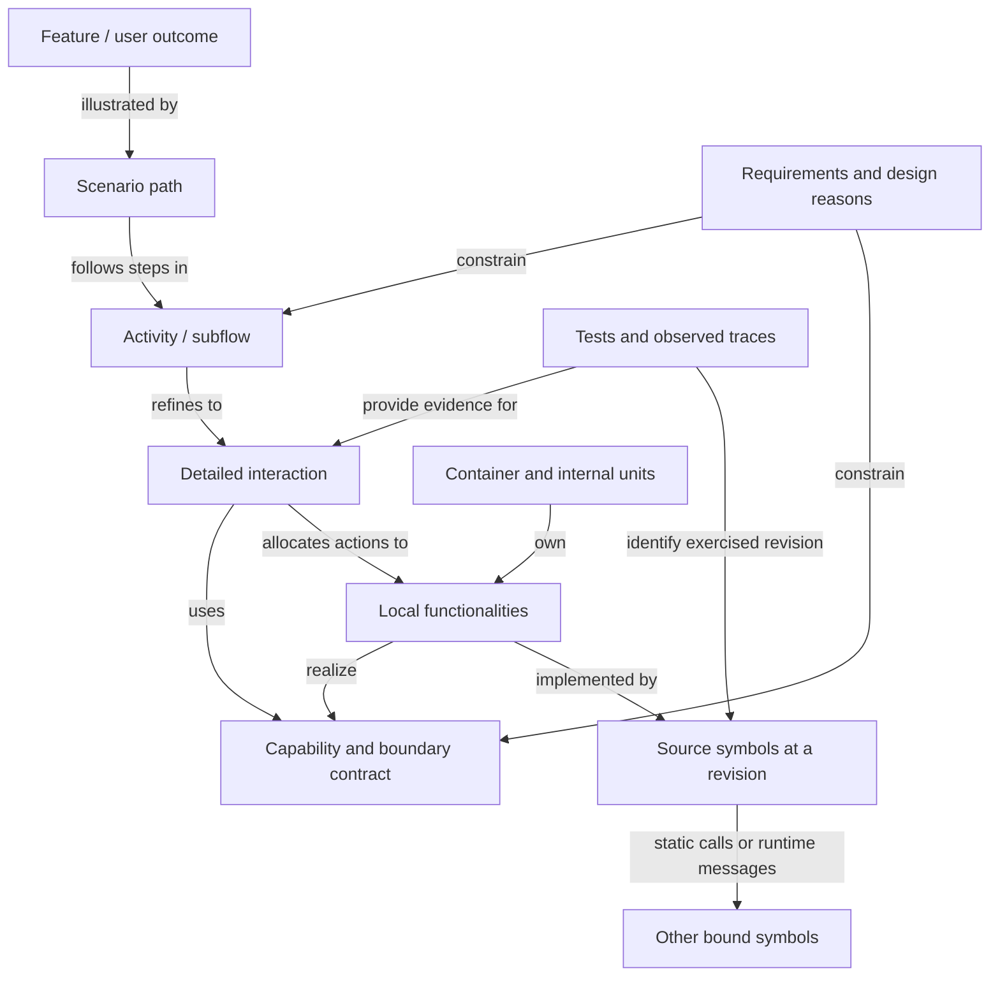
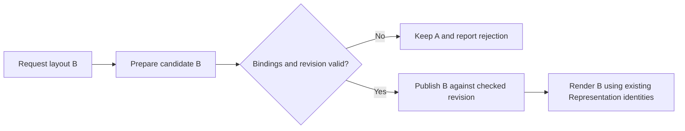

# Study: Scenarios, state and implementation traceability

Current consolidation: [Checkpoint #1](checkpoint%231/README.md), 2026-09-18.
Behavioral refinement and structural containment remain useful; the local
Functionality interpretation below is explicitly being reconsidered there.

Date: 2026-09-15

Status: conceptual refinements agreed by the owner in the subsequent
conversation; detailed formalization and pilot remain open. No modeling
language, execution engine or new SDP schema has been adopted.

This develops the owner's clarification to the
[Feature/Functionality/Channel study](Feature-Functionality-and-Channel-Study.md).
The objective is to navigate from user-oriented flow to the responsibilities,
contracts and source symbols that realize it, and back from code changes to
affected user outcomes. The owner subsequently agreed with these conceptual
changes. Exact schemas, automation and execution semantics remain to be tested.
The next [vocabulary and grammar exploration](Vocabulary-and-Grammar-Exploration.md)
examines typed nouns/verbs, qualifiers, rules and temporal expressions.

## 1. The model we are trying to make possible

An owner describes a desired outcome or edits its flow. The agent can then
open a step, inspect its behavior contract, see which capabilities and units
realize it, and continue into their internal design and implementation. A code
change can be followed in the reverse direction to expose affected outcomes.

There are two connected forms of decomposition:

- **Behavior refinement:** an activity opens into a more detailed interaction
  or subflow, with preserved conditions and outcome obligations.
- **Structural decomposition:** a Container opens into responsible internal
  units, their layering, interfaces and source bindings.

An activity may involve several units; a unit may participate in many activities.
These are connected views of a graph, not one containment tree and not a
mandatory one-Feature/one-module hierarchy.

arc42 offers a close precedent: its runtime view describes scenarios involving
existing building blocks, while its building-block view supports progressive
black-box/white-box decomposition and code locations. That supports the
navigation idea; it does not itself provide an executable model or automatic
semantic synchronization with code. [Runtime view](https://docs.arc42.org/section-6/),
[building-block view](https://docs.arc42.org/section-5/).

## 2. Ability, realization and exposure

Recommended distinction:

- A **Capability** states what a named subject can accomplish under stated
  conditions and quality expectations.
- **Functionality** is a cohesive local behavioral responsibility that helps
  realize a Capability. It remains inside one Container; internal units can own
  different contributions without becoming new Containers.
- An **Activity/Subflow** expresses how contributions cooperate: sequence,
  decisions, concurrent work, waiting and recovery.
- A **provided interface/contract** states how a collaborator accesses an
  offered ability and what it may rely on.

For example, decode, validate, correlate and retain observations may together
realize “provide coherent current measurements.” Sequencing those operations
is one realization of the ability, not its definition. Another implementation
can realize the same capability if it preserves the contract.

Capabilities can emerge from existing design, as the owner suggests. They can
also be requirements for future design. Mark an ability as desired, declared,
implemented or verified according to the available evidence; merely discovering
four function names does not prove that their composition delivers it.

Internal/external is relative to an identified boundary. A module can provide
an interface to siblings while that capability remains internal to its Container.
The Container exposes only the offers it intends to support externally.
`Consumes` describes use; `requires` describes a necessary condition for a
particular capability or mode; `depends on` identifies the dependency and its
consequences. They must not all collapse into an unlabeled arrow.

## 3. Names for behavior and state

Use **Activity** for a named behavior and **Subflow** when emphasizing that it
can be opened into smaller steps. Reserve **Event** for an occurrence. Calling
a complete workflow an event would obscure who performs it and what can fail
halfway through.

| Concept | Meaning in this proposal | Layout-change example |
|---|---|---|
| Feature | Durable user-oriented behavior. | Reconfigure presentation while retaining live context. |
| Scenario | A meaningful path/example through a flow, with actor, entry conditions and expected outcomes. | A valid new layout replaces the current layout while readings continue. |
| Activity / Subflow | Bounded behavior containing actions and possibly branches, waits or parallel work. | Prepare and publish a replacement presentation. |
| Action / step | An operation at the current abstraction level; can have a lower-level realization. | Validate candidate bindings. |
| State | Relevant variables, modes and identities owned by specified subjects. | Presentation A is active; candidate B is validating; measurement revision is r. |
| Precondition | A predicate required on entry, not necessarily a complete state snapshot. | An active Composition exists and the candidate can be resolved. |
| Guard | A predicate selecting/enabling a particular transition or branch. | Candidate bindings match the current Composition contract revision. |
| Trigger | What requests or enables handling now. | User requests a layout change; validation completes; a timeout occurs. |
| Event | An occurrence recorded/observed in the system. | Candidate validation failed. |
| Transition | A modeled relation between before/after states, under its trigger/guard and effects. | Candidate changes from validating to rejected. |
| Postcondition | Required facts after a specified outcome. | On rejection, the previous presentation remains active and failure is visible. |
| Invariant | A rule that must hold throughout the relevant execution. | Layout preparation must not take ownership of measurement truth. |
| Trace | Evidence about one actual execution, including relevant ordering and identity. | This request's observed validation, rejection and retained view. |

State-machine languages already separate events, conditions and transitions.
For example, W3C SCXML defines event/condition selection, executable transition
content, compound states and parallel regions. It is a useful semantics
reference, not a recommendation to convert MVP1 into SCXML.
[SCXML transitions](https://www.w3.org/TR/scxml/#transition),
[SCXML parallel states](https://www.w3.org/TR/scxml/#parallel).

UML 2.5.1 also supports hierarchical Activities with control/data flows and
subordinate operation calls (Sections 15.1–15.2). Its action pre/postconditions
describe expected constraints, but their enforcement is not defined by the
specification (16.2.3.1). An enabled transition need not be the selected one
(14.2.3.9.2). These distinctions support the proposed terminology and reinforce
the need to distinguish a documented obligation from an enforced runtime rule.
[OMG UML 2.5.1 specification](https://www.omg.org/spec/UML/2.5.1/PDF).

A group of changes is not automatically an atomic transaction. An Activity can
contain several transitions and visible intermediate states. If the high-level
view compresses it to one arrow, document the abstraction and expose relevant
failure/interleaving behavior when opening it. Compensation, cancellation and
rollback are distinct outcomes that need their own contracts where applicable.

## 4. From current state to possible flows

The owner's idea can first support an **enabled-action view**: given known
state and available inputs, show which activities may start and why others may
not. A conceptual rule is:

```text
enabled(activity, state, inputs) =
    entry conditions hold
    AND required inputs/resources/authority are available
    AND the trigger or invocation policy permits starting
```

Matching a precondition does not mean the activity should execute automatically.
Several activities may be enabled; selection may belong to the user, a domain
policy or a modeled scheduler. A capability describes what is possible, not an
instruction to perform every possible action.

For sequential composition, a useful proof obligation is:

```text
Post(A, selected outcome) implies Pre(B)
```

This is only a starting condition. Inputs and identities must also match, and
the needed facts must remain valid until B starts. Concurrent updates may
require a fresh guard check, expected revision or another domain-specific
coordination mechanism. A returned promise, emitted message and committed
authoritative effect are not interchangeable completion points.

State should describe the relevant slice of system knowledge, with ownership,
revision and freshness where necessary. Do not invent one globally instantaneous
snapshot of independent processes. Unknown state must not be treated as a true
precondition. Parallel regions and partial ordering can express concurrent
activity without enumerating every combination of all system variables.

Later, explicit preconditions, effects and goals could support path search or
model checking. A complete planning/execution system would additionally need
well-defined data domains, alternatives, loops, nondeterminism, resources,
failure semantics and bounds. The initial aim is navigable design and impact
analysis; automatic generation of a correct workflow is a separate claim.

## 5. Refinement links down to implementation

The diagram shows proposed relationship meanings, not an executable language.



Use three complementary views: an activity flow for ordering/branches, a state
view for lifecycle/validity, and an interaction view for messages between owners.
Each should reference the same modeled identities. A hand-drawn flow arrow
cannot on its own establish a source call or an allowed service dependency.

A lower-level realization must preserve the higher-level entry/outcome contract
and invariants. It may add internal steps; externally visible failure, ordering
or side effects need an explicit compatibility assessment. If the user outcome
changes, revise the higher-level contract rather than hide the change in a
more detailed diagram.

Recommended source-binding information is modest: model element/step, binding
role, repository revision, path and qualified symbol, plus evidence and known
limits. Useful roles include entry point, guard evaluation, state mutation,
message producer/consumer and effect. A source path alone is too coarse; line
numbers alone are too unstable. Model identity should survive ordinary renaming
while the source binding is updated.

Do not manually mirror every helper function in the design model. Bind meaningful
steps to concrete implementation entry points, then obtain local call detail
from source tools. Intent, ownership and rationale need deliberate modeling;
symbol locations, imports and many calls can be extracted. Asynchronous routing,
dependency injection, configuration, generated code and shared data require
additional evidence. A runtime trace proves an exercised path, not every possible
path. Keep declared, source-observed, runtime-observed and unresolved links distinct.

## 6. Worked example in the selected MVP1 direction

The owner has selected Representation -> Composition -> Presentation -> Renderer.
This example elaborates that direction; it is a proposed software-only pilot,
not a claim that its complete flow exists in MVP1. The
[MVP1 study](MVP1-Design-Evolution-and-SDP-Skills.md) records the direction and
inherited obligations.

**Scenario:** an operator replaces layout A with layout B while a shared length
Representation remains live in two views. B may be rejected without losing A.



Live measurement processing continues independently. The flow does not place
those updates behind candidate validation. The publication contract must define
what happens if the relevant Composition revision changes after validation.

| Level opened | What becomes visible |
|---|---|
| User flow | Request replacement; accept a valid candidate or retain the current presentation on rejection. |
| Behavior contract | Entry conditions, candidate lifecycle, success/rejection outcomes, retained identities and concurrent-update rules. |
| Capabilities | Obtain live semantic values; manage Composition lifetime; validate/publish Presentation; render schema and report typed intent. |
| Local realization | Representation state/subscriptions; Composition registry; Presentation validation/revision handling; Renderer reconciliation. These are responsibilities to design, not asserted existing class names. |
| Implementation | Existing reusable primitives with explicit source bindings, and clearly marked missing target operations. |
| Verification | Contract tests for outcomes/identity and a real UI witness for visible continuity, focus/draft policy and responsiveness. |

There are real lower-level anchors in the inspected MVP1 baseline
`7589a5811a21ec6bb13979612060ceff0f690df8`:

- [`ExternalStore.setSnapshot` and `subscribeSelector`](https://github.com/Hans-Einar/ponsse/blob/7589a5811a21ec6bb13979612060ceff0f690df8/MVP1/shared/ui-runtime/store/index.ts)
  provide snapshot publication and selected-value notification. These are
  candidate realization mechanisms, not an implemented Presentation-schema
  replacement contract.
- [`EventHub.publish`](https://github.com/Hans-Einar/ponsse/blob/7589a5811a21ec6bb13979612060ceff0f690df8/MVP1/shared/ui-runtime/event-hub/index.ts)
  provides ordered local fan-out. In this source, a publication with no listeners
  returns silently. The newer design's unhandled-consumer diagnostic expectation
  therefore cannot be claimed as satisfied simply by linking to that symbol.

Both observations come from source inspection, not tests run in this study.
The second illustrates why a traceability link needs a stated behavioral role
and evidence: a connected graph can still point at an insufficient implementation.

If a proposed flow adds a confirmation step before publication, impact analysis
must inspect pending candidate lifetime, stale-revision handling, cancellation,
typed intent and Renderer interaction. It should also check command/subscription
continuity. It should not automatically nominate machine reducers or move domain
truth into Presentation merely because they contribute data to the displayed view.
This is an illustrative change, not a newly adopted confirmation requirement.

## 7. Change-impact analysis and structural judgment

For a changed flow node, guard or route:

1. Classify the semantic change: ordering, condition, inputs, effect, owner,
   failure, quality or visual composition. Include affected branches and states.
2. Follow refinement and realization links to local responsibilities and source
   bindings; cross a unit boundary through the declared contract.
3. Follow dependencies backward to other consuming activities, capabilities
   and Features. Inspect shared state, schemas and scheduling, not just callers.
4. Compare that declared set with source/configuration searches and available
   runtime evidence. Report missing links and unknown coverage.
5. Classify results as direct edits, potentially affected consumers, regression
   witnesses, or examined-but-unaffected areas, with reasons.
6. Evaluate whether the existing allocation still has coherent responsibilities.
   Update the proposed design before authorizing an incidental structural change.

Warning signs include a simple domain decision requiring coordinated edits in
many unrelated units, shared mutable state with unclear ownership, bypassed
contracts, dependency cycles, implicit callback ordering, copied lifecycle rules,
and flow steps that can only be explained through undocumented side effects.
Many edges alone do not prove poor design: generic infrastructure is expected to
have multiple consumers. Review cohesion, reasons for change, state ownership
and coupling under realistic changes rather than applying a universal edge limit.

Compare moving orchestration, moving local functionality, clarifying a contract,
or retaining the current structure with a better boundary. A Feature crossing
several Containers is not automatically a defect. A workflow need not have its
own process. Distributed collaboration still needs explicit responsibility for
completion and recovery.

## 8. Existing foundations and practical next experiment

The interpretation above is this study's proposal, not a claim of conformance
to one existing standard.

| Foundation | Useful contribution | Limit for this objective |
|---|---|---|
| arc42 | Connected runtime scenarios and progressively decomposed building blocks with source locations. | Documentation method; the source bindings and currentness checks still need implementation. |
| UML activity/state/interaction views | Established separation of behavior flow, lifecycle and collaboration; examine this alongside the existing SysML v2 candidate. | A diagram is not automatically executable or behaviorally equivalent to code. Select precise semantics for the pilot. |
| SCXML | Defined state-machine execution with events, conditions, hierarchy and parallel regions. | Does not supply the whole Feature/capability/architecture/source model. |
| C4/Structurizr | Structural views and ordered interactions using shared model relationships. | Dynamic views do not by themselves supply complete pre/postconditions, planning or source-call inference. |

Primary references: [arc42 runtime](https://docs.arc42.org/section-6/),
[arc42 structure](https://docs.arc42.org/section-5/),
[OMG UML 2.5.1](https://www.omg.org/spec/UML/2.5.1),
[W3C SCXML](https://www.w3.org/TR/scxml/), and
[Structurizr dynamic views](https://docs.structurizr.com/dsl/language#dynamic-view).
No product choice follows merely from this table. The existing language pilot
should now test behavior refinement and source impact, not only static topology.

Start with one flow and one change to it. Reuse existing SDP records, a small
linked diagram/state table and explicit source bindings. Require the agent to
open a step all the way to inspected code, identify at least one missing or
insufficient binding, and explain which other scenarios may be affected. Check
the answer against source evidence independently. Also try a symbol rename and
an asynchronous consumer missing from the declared model.

Only after this works should we choose machine-readable encoding and automation.
A future tool should maintain explicit model facts and render multiple views
from them; edits must change those facts, not just diagram coordinates. It should
detect broken bindings and contradictions without claiming that static graph
reachability proves complete behavioral impact.

The owner supplies outcome and observed problems. The agent maintains the
refinement, responsibility and evidence links and presents the changed flow plus
its implementation consequences for review. Skills can teach that operation;
they cannot substitute for the maintained model or manufacture missing evidence.

## 9. Validation and remaining uncertainty

This is a documentary study. The two linked MVP1 implementation anchors were
read at the pinned revision; no product tests, renderer experiment, parser,
planner or impact engine were run. Diagrams express proposed semantics and have
not been executed. The cited UML sections were read from the official PDF's
extracted text; relevant SCXML, arc42 and Structurizr documentation was checked.
Exact granularity, identifiers, model storage, source-binding
automation and the handling of larger concurrent flows remain pilot questions.
Local links and Markdown fence pairing were checked. Existing skill candidates
and product code are unchanged.
