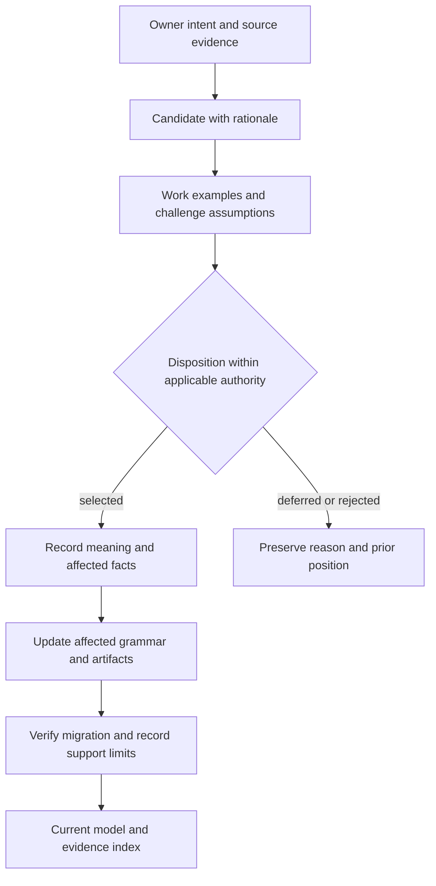

# Decisions, sources and next work

**Tillegg 2026-09-21:** CP1-D18–D23 og dagens neste leveranse står i
[07 — SDUI 0.2 og Go-retning](07-SDUI-0.2-and-Go-Direction.md). Tabell og
arbeidsforslag nedenfor er 18. september-baseline; kandidatstatus for SDL beholdes.

Date: 2026-09-18  
Status: checkpoint disposition index. A recommendation here is not a new
language implementation or a retrospective claim of owner approval.

## 1. Authority and disposition

| ID | Position | Status / consequence |
|---|---|---|
| CP1-D01 | SDP as System Development Process; SDL as its description language. | Owner-proposed direction used as this checkpoint's working name. Existing Standard Document Procedure Toolkit remains unchanged. |
| CP1-D02 | Describe all abstraction levels and connect intent to realization. | Established objective; exact level profiles and relation signatures are candidates. |
| CP1-D03 | Representation → Composition → Presentation → Renderer for the selected MVP1 UI direction. | Established owner selection; exact runtime hosting/allocation remains open. |
| CP1-D04 | A Datagram family has a data contract, variants and logical Dataset origin. | Established direction; header/version/runtime details remain candidate contracts. |
| CP1-D05 | MessageSet is generated from connection contracts and participation. | Owner-selected direction; baseline source objects/parser are not migrated. |
| CP1-D06 | One Channel concept across Container and layer boundaries. | Recommendation; Pipe/Wire naming and exact boundary rules remain open. |
| CP1-D07 | ControlSet should group Commands without owning/exposing Values as members. | New candidate prompted by the owner's concern; replaces neither the older proposal nor language semantics without a decision. |
| CP1-D08 | Value is owned state, can be internal or bound to data, and need not belong to UI Representation. | Owner-proposed direction elaborated in this checkpoint; routing, discovery and grammar remain candidates. |
| CP1-D09 | Functionality can be identified before allocation, then realized within one Container under one accountable Unit. | Revised candidate after the owner's APT example; retain local responsibility and allow pending allocation only in an explicit future intent profile. The initial broader/cross-Container recommendation is reconsidered. Core's mandatory owner rule remains unchanged. |
| CP1-D10 | Command contracts are separate from implementing functions and may be internal-only. | Candidate supporting CP1-D07/08; not every function is a Command. |
| CP1-D11 | Database abstracts where persistent data can be retrieved on demand; SQL is not required. | Owner clarification 2026-09-22 supersedes the open persistence boundary. Retention guarantees, availability, operations and grammar still need contracts; transient Dataset/cache alone is not Database. |
| CP1-D12 | One shared language/type system with level-specific authoring/completion profiles. | Recommendation; no new keywords/headers are implemented. |
| CP1-D13 | Missing execution semantics must be reported rather than guessed. | Established execution direction; interpreter and completeness checker remain future work. |
| CP1-D14 | Function names a selected design operation contributing to Functionality. | New owner-proposed concept; may read, compute or change state. No requirement to model every C++ function; exact grammar and source bindings remain open. |
| CP1-D15 | Optional Stories, Use Cases, Features and requirements form a traceable graph; scope and nature classify requirements separately. | Current conceptual recommendation; no mandatory Story/Feature intermediary or adopted classification schema. |
| CP1-D16 | Activity covers sustained/repeated behavior with instance identity, progress and outcome contracts. | Owner-proposed direction; candidate lifecycle distinguishes suspension/resumption from completion/new start. Meaningful state change during a cycle does not require different initial/final control-state labels. Exact progress restriction, interruption policy and grammar remain open. |
| CP1-D17 | Use richer Mermaid views and investigate a widget-based interactive SDL prototype. | Owner-proposed direction; bounded diagram profiles exist in XFMD. Presentation schema, executable scenario files, renderer stream and frame/input publication are proposals in the renderer study, not implemented features. |

A source document can be useful evidence without being the current proposed
meaning. These dispositions prevent “latest prose wins” from rewriting accepted
behavior or parser contracts.

This is a decision flow, not automatic promotion by document recency. Selection
and implementation support are separate facts; a selected meaning can still be
awaiting grammar, corpus or tool changes.

## 2. Reconciliation with earlier documents

| Source | Preserve | Reconsider / boundary |
|---|---|---|
| [Feature/Functionality/Channel study](../Feature-Functionality-and-Channel-Study.md) | Intent/responsibility/interaction distinctions; many-to-many Features; Capability scope; Container-local Functionality. | Pending allocation and the distinction from design Function need refinement. Its blanket warning against starting a language predates later owner-authorized language experiments. |
| [Scenarios and traceability](../Scenarios-State-and-Implementation-Traceability.md) | Separate behavior refinement and structural containment; conditions, transitions and evidence; local Functionality. | Conditions on Functionality and Function need explicit signatures and completion rules; the earlier behavioral discussion is not implemented grammar. |
| [Vocabulary exploration](../Vocabulary-and-Grammar-Exploration.md) | Typed nouns/verbs and grammatical roles. | Exploratory syntax does not add aliases to the canonical core. |
| [Language definition](../Design-Language-Definition.md) | Exact current core EBNF, signatures and unsupported-syntax boundary. | Conceptual changes here do not alter that grammar or its one-owner rule. |
| [Conformance scenarios](../Design-Language-Conformance-Scenarios.md) | Positive/negative and stale/concurrent cases. | New Value/ControlSet/profile cases need explicit addition at promotion time. |
| [MVP1 chronology and skills](../MVP1-Design-Evolution-and-SDP-Skills.md) | Pinned design evolution and selected UI direction. | Does not establish the later data/control model as implemented. |
| [MVP1 design example](../MVP1-Design-Language-Example.md) | Whole-system/UI allocation and retained obligations. | Examples predate current language candidates. |
| [Source tree/compilation study](../SDL-Source-Tree-and-Compilation-Study.md) | Explicit source membership, one System, boundary exports and bidirectional traceability. | Declaration order and profiles remain to be reconciled; folders cannot change type meaning. |
| [Executable IR study](../SDL-Executable-IR-and-Runtime-Study.md) | Structural versus executable completeness, adapters, controlled simulation and real renderer evidence. | No thread per Channel/Container; no implemented complete runtime. |
| [Whole-system exercise](../../experiments/mvp1_sdl/README.md) | Broad constituent/requirement coverage and named gaps. | Original Functionality/MessageSet meanings remain in its files; no automatic reinterpretation. |
| [Dataset/Datagram proposal](../SDL-Datasets-Datagrams-and-Data-Contracts.md) | Family/variant/source identity, projection and presence. | Value binding and revised ControlSet integration are not yet formalized there. |
| [ControlSet/layer study](../SDL-ControlSets-Layer-Boundaries-and-Data-Access.md) | Prior-art evidence, generated catalogs, layer concerns and data-access distinctions. | Its combined Commands-and-Values recommendation is now an alternative under reconsideration. |
| [How SDP Works](../How-SDP-Works.md) | Repository evidence, progressive design, bounded delivery and traceability. | Describes the existing Toolkit process, not an adopted new SDP specification. |
| [Feature governance proposal](../Feature-Governance-And-SDP-2.0.md) | Durable intent, deliberate integration and lifecycle distinctions. | Historical SDP version/role proposals are not automatically inherited by the new concept. |
| [Skill candidates](../../Toolkit/skills_v2/README.md) | Context recovery, design assessment and truthful evidence. | Candidate/not installed; this checkpoint does not update or activate skills. |

Read the checkpoint first for the current discussion, then follow a source when
its detail or rationale matters. Preserve prior records rather than deleting
evidence of how the model changed. Do not require an agent to infer the current
position from every historical issue comment.

## 3. Existing artifacts and actual evidence

- `design-core 0.1`: a bounded structural parser/AST/validator/formatter prototype.
  It is not the complete SDL described here.
- `sdl-mvp1-exercise 0.1`: 66 design files covering nine Containers and eight
  Libraries, with 332 requirement mappings and 109 Functionality definitions.
- Its recorded authoring audit reports 20 scenario graphs, 73 directly called
  Functionalities and 23 open gaps. This is inventory evidence, not behavioral
  completeness or requirement satisfaction.
- Dataset/Datagram/ControlSet, execution IR and abstraction-profile studies are
  proposals. The checkpoint introduces no running compiler/interpreter.

Counts are taken from the existing
[inventory report](../../experiments/mvp1_sdl/inventory-audit.json), not a fresh
execution or verification of product behavior. No product tests were run for
this documentation-only checkpoint.

[source-index.json](source-index.json) fingerprints the local documents/artifacts
used to consolidate this checkpoint. Some are uncommitted working documents;
hashes identify the exact inspected content without pretending they are part of
a published revision. Source pointers added during consolidation are included
in those fingerprints. The index does not attest that every referenced external
paper or repository was freshly researched on September 18.

## 4. Bounded next decisions

Do not extend the parser with all checkpoint concepts at once.

1. **Value/ControlSet witness:** work the internal Value, Datagram-bound Value,
   Representation and internal/exposed Command cases. Compare combined versus
   command-only ControlSet without duplicate authority.
2. **Functionality/Function decision:** use the APT example to test pending early
   allocation, a Container-local import responsibility and selected design
   Functions with outcome/state contracts. Reconcile the core ownership rule and
   migrate only entries whose meaning has been explicitly reviewed.
3. **Refinement contract:** define the minimum information that preserves
   preconditions, outcomes, state authority and quality through one detailed flow.
   Use the timber-harvesting witness to distinguish iteration progress, suspension,
   resume revalidation and terminal outcomes. Record unresolved product policy
   rather than silently selecting it while implementing an interpreter.
4. **Profile design:** specify one type system, declaration/reference rules and
   the checks required at intent, architecture, detailed and execution stages.
5. **Controlled promotion:** update the general language definition, examples,
   negative cases, parser and explicit corpus migration for the selected subset.
6. **Interactive witness:** use [the renderer study](06-Interactive-Prototype-and-Renderer-Study.md)
   to define one widget/Value/Command/Activity slice. Distinguish a scripted demo
   from verified modeled behavior before adding the proposed stream transport.

No separate global Value or Function keyword, profile syntax or
universal expression language is accepted merely because this checkpoint uses
those concepts in explanatory prose.

## 5. Keeping the documentation maintainable

Use a small current index that names selected definitions, candidate alternatives
and implementation support. Each material decision links its reason, affected
facts, prior position and evidence. Each language increment identifies which
checkpoint decisions it adopts.

A source of truth is assigned per fact/semantic version, not per whichever file
an agent happened to read last. Older documents should point forward when their
interpretation is under review; they should not silently acquire new meanings.

Prefer referenced facts and generated views over copied inventories. Keep design
sources separate from generated MessageSets, diagrams and code bindings.
Unresolved links and coverage gaps should be visible in reports, not hidden by
plausible prose.

Before declaring a future checkpoint authoritative, list what changed, what
remained open, which older meanings are superseded and which implementations
actually migrated. A checkpoint is a shared reasoning baseline, not a shortcut
around those decisions.

Revision note, 2026-09-18: the owner's APT example reopens the initial recommendation
to broaden Functionality across Containers. The current candidate retains local
scope after allocation, adds design Function, distinguishes functional versus
user/system requirement classifications and strengthens design-completion criteria.
These edits change the discussion checkpoint, not the general grammar or corpus.

Further revision, 2026-09-18: the owner's sustained harvesting Activity restores
explicit attention to behavior over time. Section 9 of the model and Section 11
of the worked examples distinguish Activity definition/instance, scoped State,
progress, suspension, resumption and outcome-specific postconditions. These are
candidate refinements of the earlier behavioral study, not implemented semantics.
