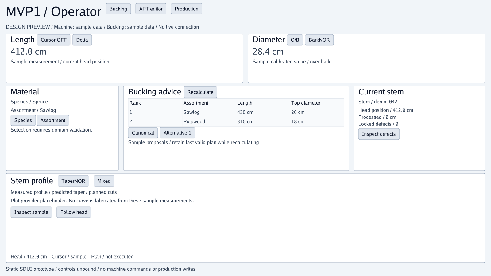
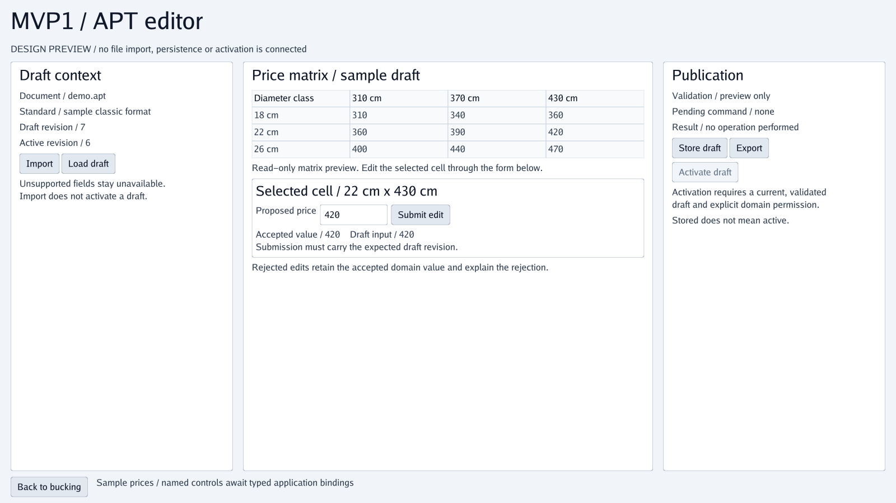
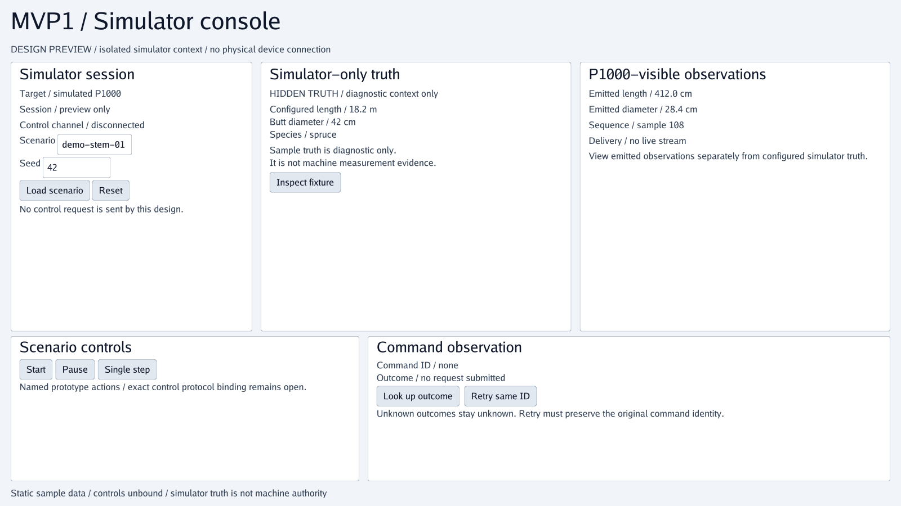

# MVP1 UI design previews

Generated by export_ui.py through the Go SDUI parser and SVG exporter.
Static sample states: controls are unbound; no SDL/domain actions are executed.
These are review snapshots, not on-demand SDL viewpoint generation.

[Source and binding guide](../SDL/MVP1/SDUI/README.md)

Viewport: 1600 x 900 logical units; SDUI source dimensions remain relative.

## Operator dashboard

[SDUI source](../SDL/MVP1/SDUI/BuckingUI/MainPage.sdui) | [AST](operator.ast.json) | [Console dump](operator.txt)

## APT draft editor

[SDUI source](../SDL/MVP1/SDUI/BuckingUI/AptEditor.sdui) | [AST](apt.ast.json) | [Console dump](apt.txt)

## Simulator console

[SDUI source](../SDL/MVP1/SDUI/SimulatorUI/MainPage.sdui) | [AST](simulator.ast.json) | [Console dump](simulator.txt)
